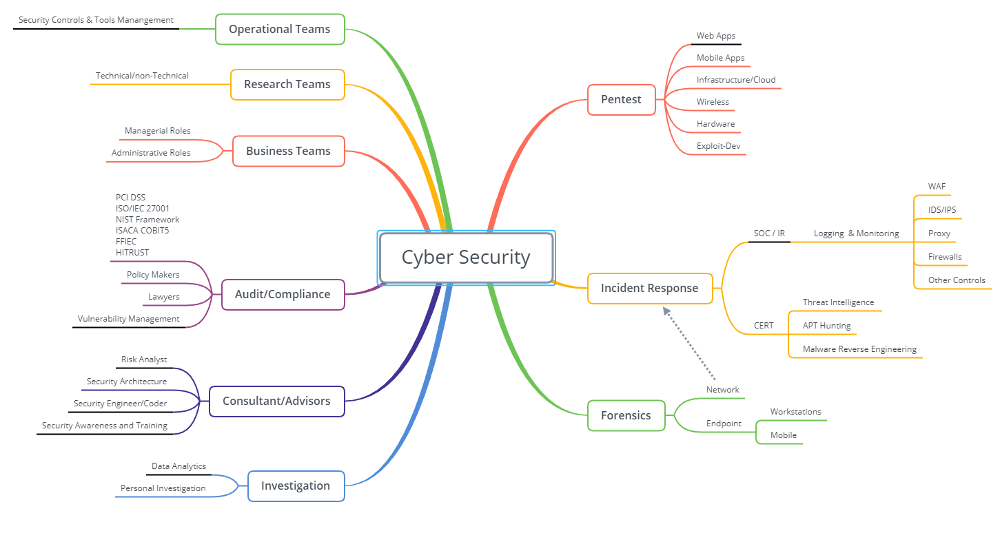

# Security-Resources for Self-Paced Learners

Archive of Security Resources - Trainings, meetups, Links, podcasts - addressing all types of learners Audio, Visual, Text and hands-on/Laboratory

Before you begin, explore where you would like to head towards in your training.

**Cyber Security Pathways**

 Image - https://github.com/Add3r/Security-Resources/blob/master/CyberSecurityPathways.png
 
 
 https://www.cyberseek.org/pathway.html
 
Preferred Certifications - 
+ https://github.com/Add3r/Security-Resources/blob/master/Career-Guide.pdf ( refer image - Page 12 )
+ https://pauljerimy.com/security-certification-roadmap/

####### Post Covid-19 with more people reaching out to up-skill in Cyber Security field. #########
####### Recommend to go through the following Computer science introductory material before deep diving into security content ########
1. https://www.khanacademy.org/computing/computer-science/computers-and-internet-code-org
2. https://www.edx.org/microbachelors/nyux-computer-science-fundamentals
3. https://www.youtube.com/playlist?list=PL8dPuuaLjXtNlUrzyH5r6jN9ulIgZBpdo

something very important "Developing Self Interest & Motivation" good resources for that - https://zenpencils.com/newreaders/, https://jockopodcast.com/.

What Realistic in hacking and whats not ? - https://www.youtube.com/watch?v=SZQz9tkEHIg (Applied Hacking - Hacker explaining with movie content)

Different Security Assessment types:  https://danielmiessler.com/study/security-assessment-types/

CTF Based Training - Free/Paid
* Hack the Box - https://www.hackthebox.eu/
* Try Hack Me - https://tryhackme.com/
* Offensive Security Proving Grounds - https://www.offensive-security.com/labs/
* Pentester Lab - https://pentesterlab.com/
* Attack Defence Labs - https://attackdefense.com/

CTF based Training - Free

* http://opensecuritytraining.info/ (Provides a wide range of security content with Lab Environments)
* https://liveoverflow.com/getting-into-browser-exploitation-new-series-introduction-browser-0x00/ (Browser Exploitation 
* http://overthewire.org/wargames/ (training in most of areas, i.e. – WebApps, Network)
* https://exploit-exercises.com/nebula/ - Software exploitation
* https://www.offensive-security.com/metasploit-unleashed/requirements/ - Network and infrastructure
* https://www.vulnhub.com/ - More vulnerable Virtual Machines in different areas of focus
* https://ctftime.org/ - CTFs that happen around the world, for prize or money
* https://www.fuzzysecurity.com/ - Software Exploitation
* https://www.owasp.org/index.php/Category:Attack – Web Application
* https://securitycompass.github.io/iPhoneLabs/ - iPhones exploitation
* http://securitycompass.github.io/AndroidLabs/- Android Exploitation
* https://pen-testing.sans.org/blog/2011/10/07/welcome-to-the-sans-pen-test-blog - General Pentest blog to follow
* http://flaws.cloud/ - CTF on AWS
* https://github.com/sectalks/sectalks/tree/master/talks/MEL0x0e - Packet Dissection and File carving

FREE Distance Learning courses
* https://samsclass.info/128/128_S19.shtml - Mobile Application Hacking
* https://samsclass.info/50/50_S19.shtml - Network Security Monitoring
* https://samsclass.info/126/126_F18.shtml - Practical Malware Analysis
* https://samsclass.info/127/127_F18.shtml - Exploit Development
* https://samsclass.info/152/152_F18.shtml - Incident Response
* https://samsclass.info/129S/129S_S18.shtml - Web Application hacking
* https://samsclass.info/141/141_F17.shtml - Cryptography for Computer Networks
* https://samsclass.info/120/120_S16.shtml - Security+ Cert prep

CTF based Training - Paid
* https://www.offensive-security.com/information-security-certifications/oscp-offensive-security-certified-professional/ - OSCP – Covers majority of the streams
* http://www.securitytube-training.com/online-courses/securitytube-wi-fi-security-expert/index.html - Wireless attacks training from the author of Café-Latte attack. More better advanced attack than OSWP
* http://www.pentesteracademy.com/ - covers a range of domains in Pentest
* https://pen-testing.sans.org/training/courses - Pentest courses - costly and don’t recommend at this stage
* http://www.crest-approved.org/uk/partners/crest-accredited-training-courses/index.html - Highly regarded security certification in UK,AUS,NZ if pentesting is your career to choose.
* https://public.attackdefense.com/ - Covers majority of the security streams
* https://login.linuxacademy.com/ - Very good Resource to learn Cloud,DevOps and other technical contents. Same as attack and defense lab, no local lab deployment needed.
* https://www.pentesteracademy.com/redteamlab - Windows Red Team Lab

Books for Learners who love to read

* https://nostarch.com/ - Really good collection of both security and non-security related books for all age/skill levels
* https://b-ok.global/ - Free ebooks
* http://libgen.rs/ - Free ebooks

Technical Meetups to join and Learn – in Melbourne

* https://www.meetup.com/en-AU/SecTalks-Melbourne/
* https://www.meetup.com/en-AU/CryptoParty-Melbourne/
* https://www.meetup.com/en-AU/Cyberspectrum-Melbourne/
* https://www.meetup.com/en-AU/Application-Security-OWASP-Melbourne/
* https://www.meetup.com/en-AU/platypus-infosec-melbourne/
* https://www.meetup.com/en-AU/Melbourne-AWS-Security-User-Group/
* https://www.meetup.com/en-AU/meetup-group-BPNYjOrM/
* https://www.meetup.com/en-AU/Melbourne-DevSecOps-User-Group/
* https://www.meetup.com/en-AU/All-Sec/
* https://www.sans.org/talks

Security Conferences - ANZ

* Black Hat & DEFCON (US)
* https://2016.kiwicon.org/
* Ruxcon melbourne
* OWASP AppSec Day
* OzSecCon
* BSIDES Canberra ( and other states as well )
* CloudSec
* AusCERT
* AISA

Past Conference Videos: http://www.irongeek.com/

Training Video content

* https://www.youtube.com/channel/UCthV50MozQIfawL9a_g5rdg
* https://www.youtube.com/channel/UC3s0BtrBJpwNDaflRSoiieQ
* https://www.youtube.com/user/SilvioCesare
* https://www.youtube.com/channel/UC4m2G6T18_JcjwxwtwKJijw
* https://greatscottgadgets.com/sdr/1/
* https://www.youtube.com/channel/UCe8j61ABYDuPTdtjItD2veA
* https://www.youtube.com/channel/UCJ2U9Dq9NckqHMbcUupgF0A

Awareness Videos/Documentary/Movies/TV-Series

* https://www.youtube.com/watch?v=qLg3e4TNQIU
* https://www.youtube.com/watch?v=U3QXMMV-Srs
* https://www.youtube.com/watch?v=FqibWHfn_Yc
* https://www.youtube.com/watch?v=kJyGZDXCbmA
* https://www.youtube.com/watch?v=HW9hH0vlPEM
* Documentary on Stuxnet - http://www.zerodaysfilm.com/
* Hackers movie - https://www.imdb.com/title/tt0113243/
* Mr.Robot - https://www.imdb.com/title/tt4158110/
 
Security Podcasts

* https://www.blackhillsinfosec.com/podcasts/
* https://securityweekly.com/
* https://risky.biz/netcasts/risky-business/
* http://podcast.wh1t3rabbit.net/
* https://defensivesecurity.org/
* https://isc.sans.edu/podcast.html - Good weekly over the horizon current threat landscape
* https://podcasts.apple.com/au/podcast/healthcare-information-security-podcast/id504642987
* https://www.smashingsecurity.com/
* https://darknetdiaries.com/episode/36/
* https://www.grc.com/securitynow.htm

Security News Links & apps

* https://www.morningstarsecurity.com/news
* https://play.google.com/store/apps/details?id=com.briox.riversip.rnd.cybersecurity&hl=en
* https://itunes.apple.com/us/app/cyber-security-news-alerts/id792406035?mt=8
* https://www.wired.com/tag/technology/
* https://news.ycombinator.com/
* https://thehackernews.com/
